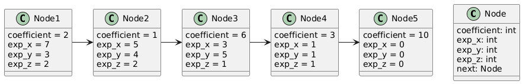
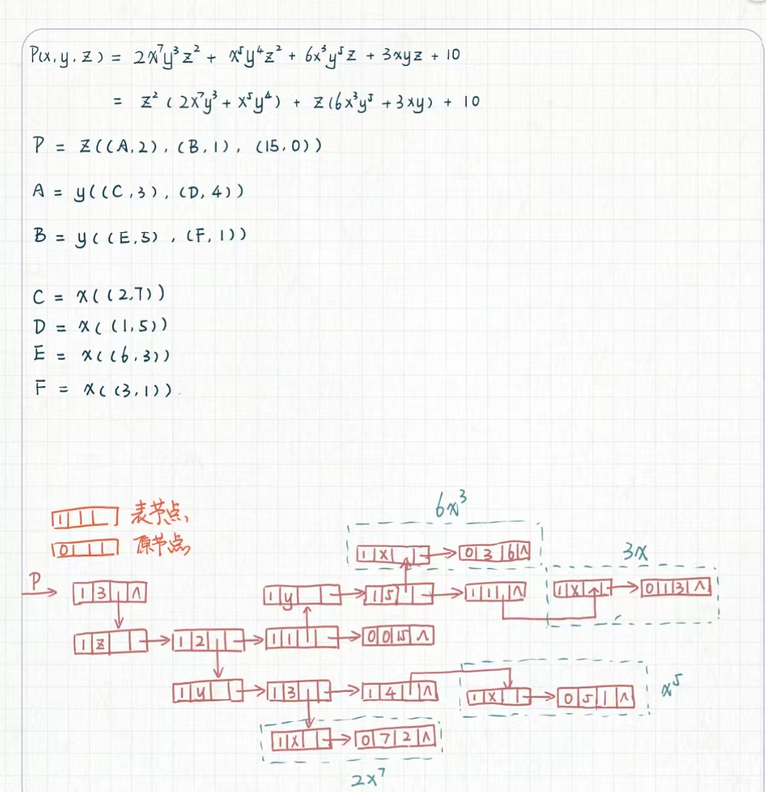

# 二叉树实验 - 实验05

## 实验内容
### 一. 根据n元多项式链表的存储结构，画出下列三元多项式的存储结构图。
$$P(x,y,z) = 2x^{7}y^{3}z^{2} +x^{5}y^{4}z^{2} + 6x^{3}y^{5}z+ 3xyz + 10$$

### 二. （编程题）构造一棵二叉树，分别实现先序、中序、后序遍历方法，并将结果打印出来。


## 实现
> 实现的文件结构如下： `include`目录下是类定义的.h文件，`lib`目录下是类实现的.cpp文件，`src`目录下是主函数，`test`目录下是测试文件。
> 因为使用模板类所以使用.hpp保证模板类的实现的可见性
> 本次三个小题在`test`文件夹下有单独的测试文件，在`main.cpp`中有三者统一的测试文件


## 实验现象

### 题目一

> 本来以为这里需要选择更优的解法，但是发现教材内容是广义表表述m元多项式，虽然本人不是很赞同该写法，但是仍然补充两个实现方法。

#### 非广义表的实现
使用`PlantUML`进行绘图，具体代码如下：
```
@startuml
class Node {
  coefficient: int
  exp_x: int
  exp_y: int
  exp_z: int
  next: Node
}

Node1 : coefficient = 2
Node1 : exp_x = 7
Node1 : exp_y = 3
Node1 : exp_z = 2

Node2 : coefficient = 1
Node2 : exp_x = 5
Node2 : exp_y = 4
Node2 : exp_z = 2

Node3 : coefficient = 6
Node3 : exp_x = 3
Node3 : exp_y = 5
Node3 : exp_z = 1

Node4 : coefficient = 3
Node4 : exp_x = 1
Node4 : exp_y = 1
Node4 : exp_z = 1

Node5 : coefficient = 10
Node5 : exp_x = 0
Node5 : exp_y = 0
Node5 : exp_z = 0

Node1 -> Node2
Node2 -> Node3
Node3 -> Node4
Node4 -> Node5
@enduml
```
表图如下：


#### 广义表实现如下



### 题目二

具体实现参考`include/BinaryTree.hpp`,在`src/main.cpp`中进行测试。
测试建立的二叉树如下：

以下是运行结果：
