# 实验07

## 实验内容
### 第一题（简答题）：
 1.1 由如图所示的二叉树，回答以下问题： 
（1）画出该二叉树的前序线索二叉树； 
（2）画出该二叉树的中序线索二叉树；
（3）画出该二叉树的后序线索二叉树。
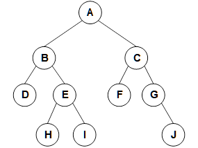


1.2 请将下列的树转换成相应的二叉树。
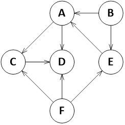

1.3 请将下列的森林转换成相应的二叉树，并给出该森林的先根遍历、中根遍历以及后根遍历结果。
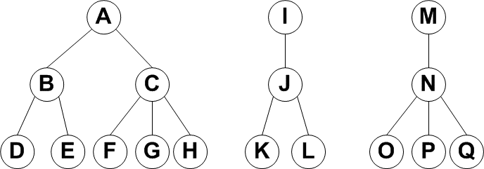

### 第二题（编程题）：
画出下图所示的无向图的邻接矩阵，并编写代码，输出该邻接矩阵。
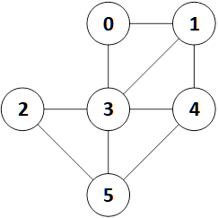


## 实现
> 实现的文件结构如下： `include`目录下是类定义的.h文件，`lib`目录下是类实现的.cpp文件，`src`目录下是主函数，`test`目录下是测试文件。
> 因为使用模板类所以使用.hpp保证模板类的实现的可见性
> 本次三个小题在`test`文件夹下有单独的测试文件，在`main.cpp`中有三者统一的测试文件


## 实验现象

### 题目一

#### 1.1
使用`T(X)`表示是指向`X`的线索指针
1) 前序线索二叉树：
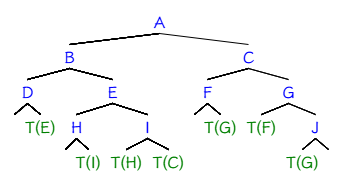
2) 中序线索二叉树：
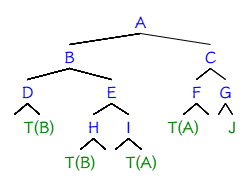
3) 后序线索二叉树：
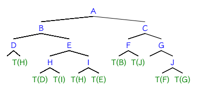

#### 1.2
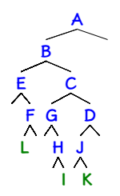

#### 1.3
转化为的二叉树：
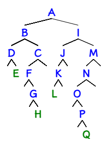

先根遍历： `ABDECFGHIJKLMNOPQ`
中根遍历： `DEBFCGHALKJIONQPM`
后根遍历： `EDFHGCBLKJOQPNMIA` 

### 题目二
题目无向连通图对应的相邻矩阵是：
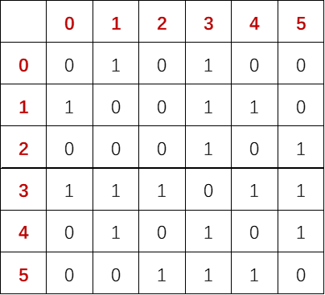
使用代码实现输出结果：
```cpp
#include <iostream>
#include <vector>

int main() {

    const int numNodes = 6;

    std::vector<std::vector<int>> adjacencyMatrix(numNodes, std::vector<int>(numNodes, 0));

    adjacencyMatrix[0][1] = 1;
    adjacencyMatrix[0][3] = 1;

    adjacencyMatrix[1][3] = 1;
    adjacencyMatrix[1][4] = 1;

    adjacencyMatrix[2][3] = 1;
    adjacencyMatrix[2][5] = 1;

    adjacencyMatrix[3][4] = 1;
    adjacencyMatrix[3][5] = 1;

    adjacencyMatrix[4][5] = 1;

    for (int i = 0; i < numNodes; ++i) {
        for (int j = i + 1; j < numNodes; ++j) {
            adjacencyMatrix[j][i] = adjacencyMatrix[i][j];
        }
    }

    std::cout << "Adjacency matrix of the undirected graph:" << std::endl;
    for (int i = 0; i < numNodes; ++i) {
        for (int j = 0; j < numNodes; ++j) {
            std::cout << adjacencyMatrix[i][j] << " ";
        }
        std::cout << std::endl;
    }

    return 0;
}
```
代码实现结果：
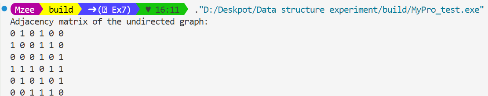