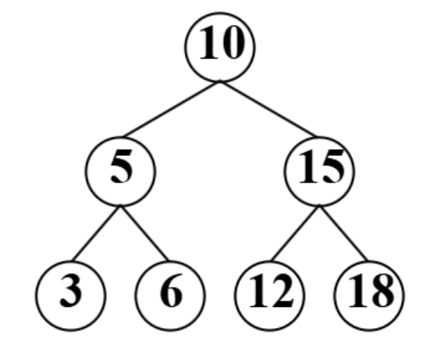

# 队列实验

## 实验内容
### 一. 构造一个循环队列：
以front和length分别表示循环队列的队头位置和队列中所含元素的个数（注意：没有rear了）。请完成循环队列判断队空、队满、入队和出队函数的编写。。

### 二. 设计算法，利用栈完成中缀表达式的计算。

## 实现
> 实现的文件结构如下： `include`目录下是类定义的.h文件，`lib`目录下是类实现的.cpp文件，`src`目录下是主函数，`test`目录下是测试文件。
> 因为使用模板类所以使用.hpp保证模板类的实现的可见性
> 本次三个小题在`test`文件夹下有单独的测试文件，在`main.cpp`中有三者统一的测试文件

## 实验现象
