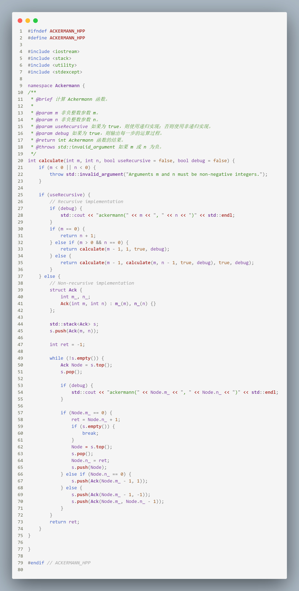

# 队列实验

## 实验内容
### 一. 编写程序，实现KMP算法；

### 二. 按照要求实现阿克曼函数的计算
$$
    ACK(m, n) = 
   \begin{cases} 
   n + 1 & \text{for } m = 0 \\ 
   \text{ACK}(m - 1, 1) & \text{for } m \neq 0, n = 0 \\ 
   \text{ACK}(m - 1, \text{ACK}(m, n - 1)) & \text{for } m \neq 0, n \neq 0 
   \end{cases}
   $$

1. 给出计算 $\text{ACK}(m, n)$ 的递归算法和非递归算法。
2. 写出 $\text{ACK}(2, 1)$ 的计算过程。（注：程序打印出来也可以，手动写出来也可以）

## 实现
> 实现的文件结构如下： `include`目录下是类定义的.h文件，`lib`目录下是类实现的.cpp文件，`src`目录下是主函数，`test`目录下是测试文件。
> 因为使用模板类所以使用.hpp保证模板类的实现的可见性
> 本次三个小题在`test`文件夹下有单独的测试文件，在`main.cpp`中有三者统一的测试文件

## 实验现象

### 题目一

详细见`include/KMP.hpp`
测试样例可以见`test/KMP_test.cpp`

### 题目二
1. 详细见`include/Ackermann.hpp`
    
2. 测试效果
    

更加直观的计算过程
$$
\begin{align*}
\text{ACK}(2, 1) & = \text{ACK}(1, \text{ACK}(2, 0)) \\
                 & = \text{ACK}(1, \text{ACK}(1, 1)) \\
                 & = \text{ACK}(1, \text{ACK}(0, \text{ACK}(1, 0))) \\
                 & = \text{ACK}(1, \text{ACK}(0, \text{ACK}(0, 1))) \\
                 & = \text{ACK}(1, \text{ACK}(0, 2)) \\
                 & = \text{ACK}(1, 3) \\
                 & = \text{ACK}(0, \text{ACK}(1, 2)) \\
                 & = \text{ACK}(0, \text{ACK}(0, \text{ACK}(1, 1))) \\
                 & = \text{ACK}(0, \text{ACK}(0, 3)) \\
                 & = \text{ACK}(0, 4) \\
                 & = 5
\end{align*}
$$

最终，得到 $\text{ACK}(2, 1) = 5$。