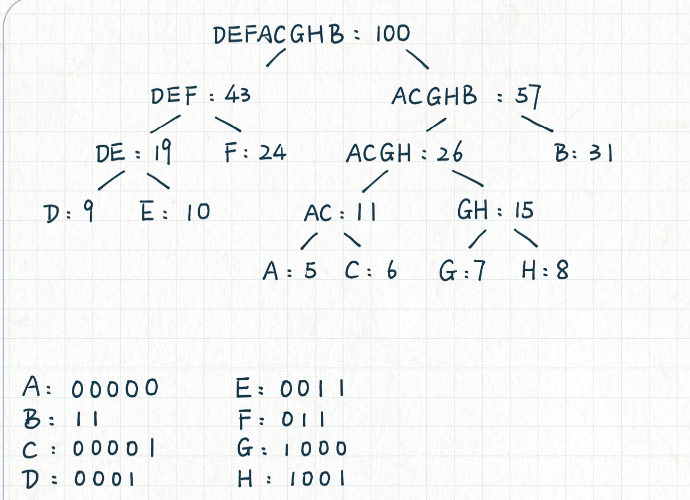
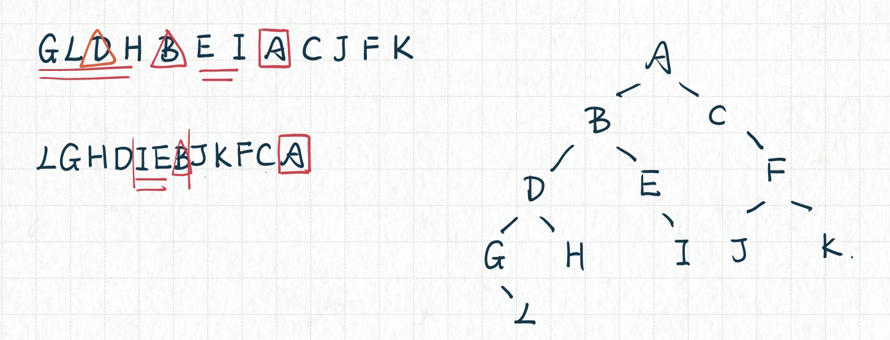

# 二叉树实验 - 实验05

## 实验内容
### 第一题（应用题）：
> 假设用于通信的电文由8个字符（A、B、C、D、E、F、G、H）组成，其出现的频率为5，31，6，9，10，24，7，8。
> （1）根据各字符的频率构造哈夫曼树（要求两棵树合并时权小的作为左子树）；
> （2）并给出各字符的哈夫曼编码。
> （注意：直接把画好的图，放在插在本word文档中就可以了）  

### 第二题（应用题）：
> 已知一棵二叉树的中序序列为：GLDHBEIACJFK
> 后序序列为：LGHDIEBJKFCA
> 请画出这棵二叉树。【注意：只要结果（图）】

### 第三题（编程题）：
> 编写程序，判别以下序列是否为堆？（注意：有可能是最小堆或最大堆）如果不是，则把它调整为堆（要求：数据元素交换次数最少），并打印出来。
> （1）	（100，86，48，73，35，39，42，57，66，21）
> （2）	（12，70，33，65，24，56，48，92，86，33）

## 实现
> 实现的文件结构如下： `include`目录下是类定义的.h文件，`lib`目录下是类实现的.cpp文件，`src`目录下是主函数，`test`目录下是测试文件。
> 因为使用模板类所以使用.hpp保证模板类的实现的可见性
> 本次三个小题在`test`文件夹下有单独的测试文件，在`main.cpp`中有三者统一的测试文件

## 实验现象

### 题目一

### 题目二

### 题目三
函数实现在`heap.hpp`，测试函数在`main.cpp`
