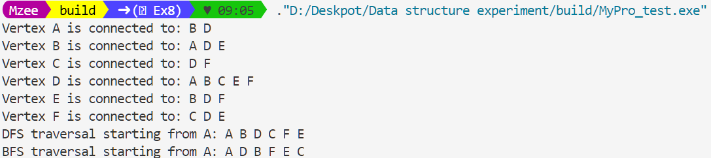

# 链表实验

## 实验内容
### 一. 构造带头节点的单链表，试编写下列函数：
(1)	定位函数：在单链表中寻找第i个节点。若找到，则返回第i个节点的地址；否则则返回空指针；
(2)	统计函数：统计单链表中等于给定值e的元素个数。

### 二. 构建一个空的双向链表，并实现数据元素的插入、删除与查找功能。并能打印出插入、删除前和插入、删除后线性表结果。

### 三. 构造一个单循环链表，并设计函数实现一元多项式的下列操作：
(1)	编写一个函数Polynomial::Calc(x)，根据参数x计算多项式的值。
(2)	重载运算符+，实现多项式相加操作。

## 实现
> 实现的文件结构如下： `include`目录下是类定义的.h文件，`lib`目录下是类实现的.cpp文件，`src`目录下是主函数，`test`目录下是测试文件。
> 因为使用模板类所以使用.hpp保证模板类的实现的可见性
> 本次三个小题在`test`文件夹下有单独的测试文件，在`main.cpp`中有三者统一的测试文件

## 实验现象
