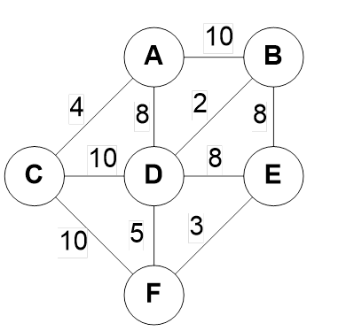
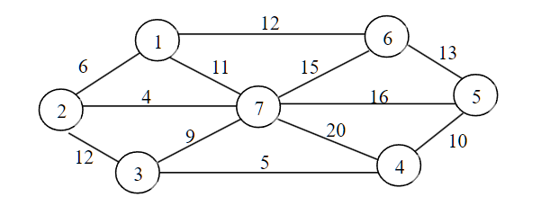
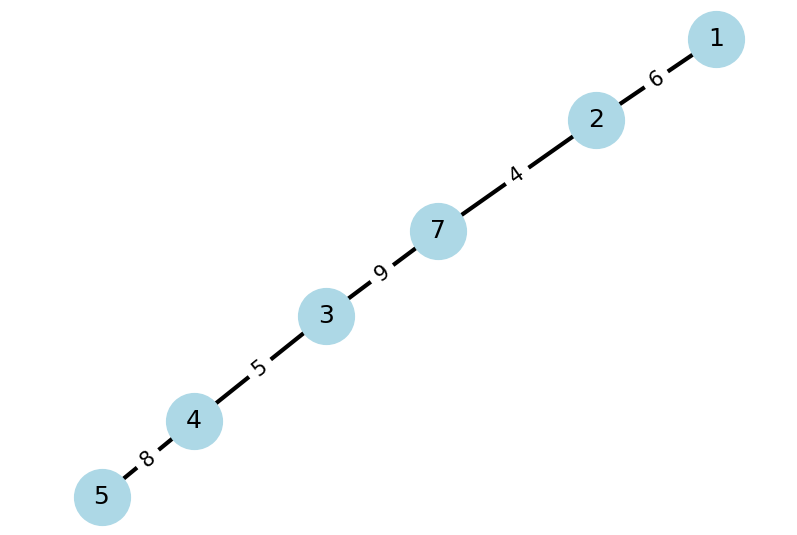
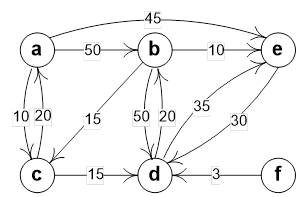

# 实验09

## 第一题
1. 请对下图所示的无向带权图：
（1）写出它的邻接矩阵，并按普利姆算法求其最小生成树加入边的顺序；
（2）写出它的邻接表，并按克鲁斯卡尔算法求其最小生成树加入边的顺序。


### 解答
#### 1. 邻接矩阵
```
    A   B   C   D   E   F
A [ 0, 10,  4,  8,  0,  0 ]
B [10,  0,  0,  2,  8,  0 ]
C [ 4,  0,  0, 10,  0, 10 ]
D [ 8,  2, 10,  0,  8,  3 ]
E [ 0,  8,  0,  8,  0,  3 ]
F [ 0,  0, 10,  3,  3,  0 ]
```
- **加入边的顺序**：AC, CF, FD, DB, DE
- **总权重**：4 + 10 + 3 + 2 + 8 = **27**

#### 2. 邻接表
```
A: (B, 10), (C, 4), (D, 8)
B: (A, 10), (D, 2), (E, 8)
C: (A, 4), (D, 10), (F, 10)
D: (A, 8), (B, 2), (C, 10), (E, 8), (F, 3)
E: (B, 8), (D, 8), (F, 3)
F: (C, 10), (D, 3), (E, 3)
```
- **加入边的顺序**：DB, FD, FE, AC, DE
- **总权重**：**20**

## 第二题
2．请用克鲁斯卡尔和普里姆两种算法分别为图G（如下图所示）构造最小生成树。
（1）给出用克鲁斯卡尔算法得到生成树中分支的顺序。
（2）给出顶点7开始用普里姆算法得到的加入生成树中顶点的次序。
（3）画出最小生成树。


### 解答
#### （1）
- **加入边的顺序**： (2, 7, 4), (3, 4, 5), (1, 2, 6), (3, 7, 9), (4, 5, 8)
- **总权重**： 4 + 5 + 6 + 9 + 8 = 32
  
#### （2）
- **顶点加入次序**：7 → 2 → 1 → 3 → 4 → 5 → 6
- **总权重**： 45
  
#### （3）


## 第三题

3. 如下图示，利用Dijkstra算法，求从顶点b到其他各顶点间的最短路径和路径长度并写出执行算法过程中辅助数组的每一步变化。


| 步骤 | 已选顶点 | a    | b   | c    | d    | e    | f    |
|------|----------|------|-----|------|------|------|------|
| 初始 | -        | ∞    | 0   | ∞    | ∞    | ∞    | ∞    |
| 1    | b        | ∞    | 0   | 15   | 50   | 10   | ∞    |
| 2    | e        | ∞    | 0   | 15   | 40   | 10   | ∞    |
| 3    | c        | 35   | 0   | 15   | 30   | 10   | ∞    |
| 4    | d        | 35   | 0   | 15   | 30   | 10   | ∞    |
| 5    | a        | 35   | 0   | 15   | 30   | 10   | ∞    |

### 解答

#### 算法步骤说明：
1. **初始化**：顶点 **b** 的距离为 0，其他顶点初始化为 ∞。
2. **选择 b**：标记 **b**，更新其邻接顶点 **c** (15)、**d** (50)、**e** (10)。
3. **选择 e**：标记 **e**，更新 **d** 的距离为 40（通过 **e→d**）。
4. **选择 c**：标记 **c**，更新 **a** 为 35（通过 **c→a**）和 **d** 为 30（通过 **c→d**）。
5. **选择 d**：标记 **d**，但无新更新。
6. **选择 a**：标记 **a**，无新更新。
7. **f** 未被访问，保持 ∞。

#### 最终结果：
- **b → a**：最短路径为 **b → c → a**，长度 **35**。
- **b → c**：最短路径为 **b → c**，长度 **15**。
- **b → d**：最短路径为 **b → c → d**，长度 **30**。
- **b → e**：最短路径为 **b → e**，长度 **10**。
- **b → f**：无路径，长度 **∞**。

## 书 P268 5
0 -> 0: 0
0 -> 1: 5
0 -> 2: 30
0 -> 3: -5
0 -> 4: 10
0 -> 5: 15

## 书 P268 6
```
dist = [
    [0, 5, 30, -5, 10, 15],
    [∞, 0, 5, ∞, 45, -10],
    [∞, ∞, 0, ∞, ∞, -15],
    [∞, 10, 35, 0, 20, 5],
    [∞, ∞, 30, ∞, 0, 35],
    [79, 84, 109, 59, 89, 0]
]
```

## 书 P268 8

1. **事件的 \( ve[i] \) 和 \( vl[i] \)：**
   ```
   ve = [0, 8, 11, 4, 10, 17, 26]
   vl = [0, 8, 11, 14, 15, 17, 26]
   ```

2. **活动的 \( e[ai] \) 和 \( l[ai] \)：**
   ```
   e[a1] = 0, l[a1] = 0
   e[a3] = 0, l[a3] = 10
   e[a4] = 8, l[a4] = 8
   e[a6] = 4, l[a6] = 14
   e[a7] = 8, l[a7] = 13
   e[a5] = 11, l[a5] = 11
   e[a9] = 10, l[a9] = 15
   e[a8] = 10, l[a8] = 19
   e[a11] = 17, l[a11] = 17
   ```

3. **关键路径**：
   ```
   0 → 1 → 2 → 5 → 6
   ```